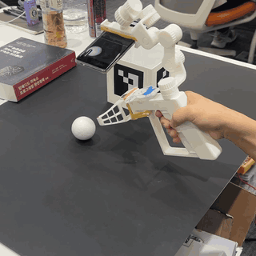
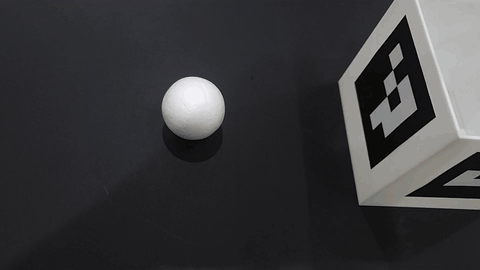
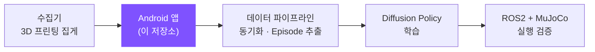
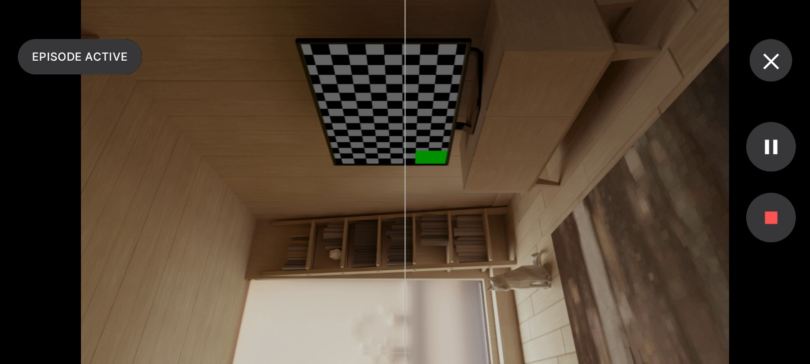
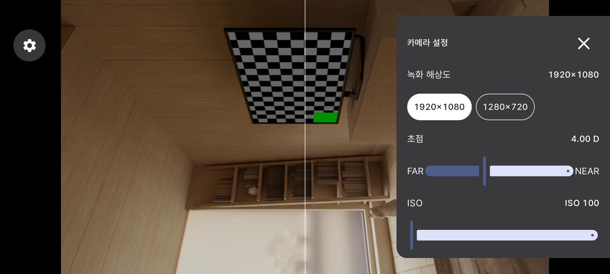
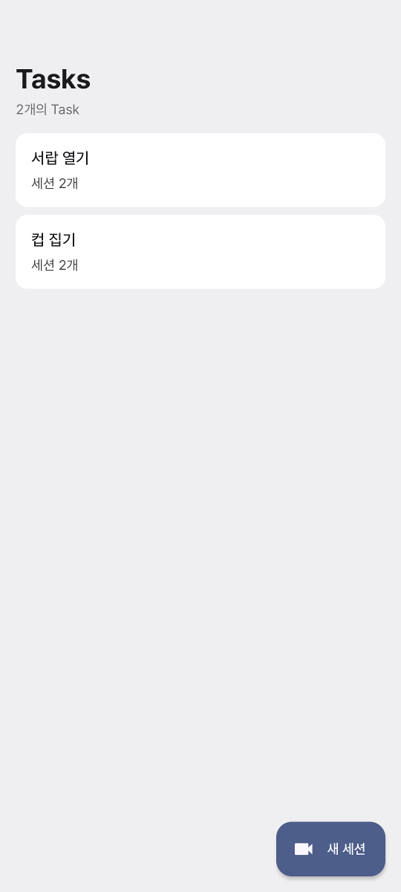
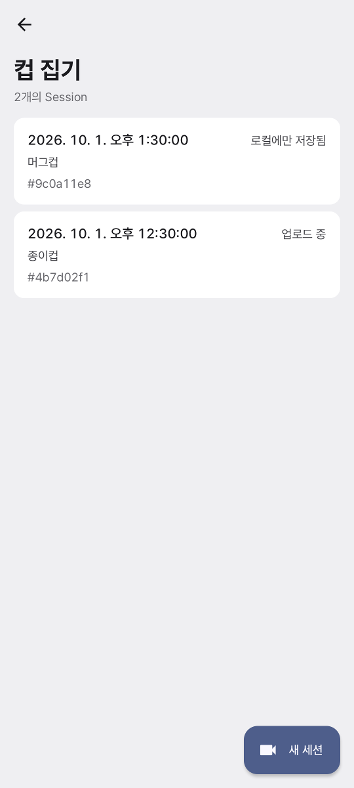
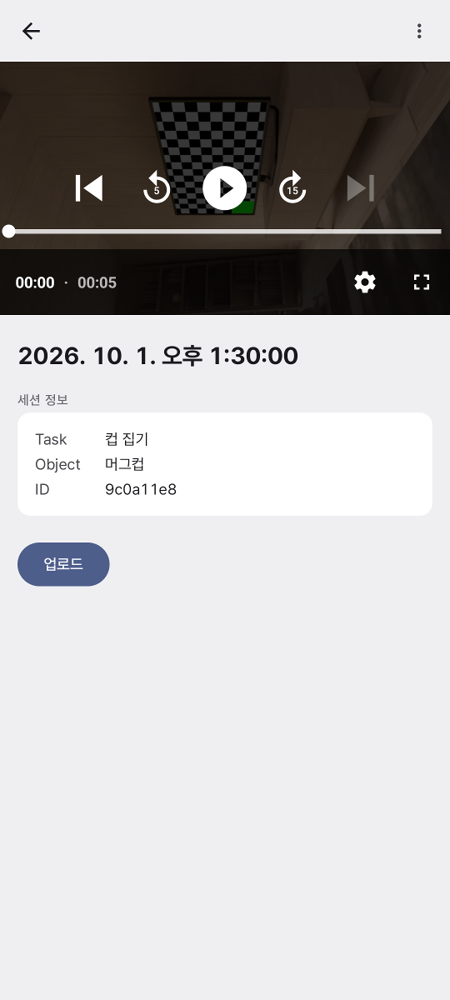
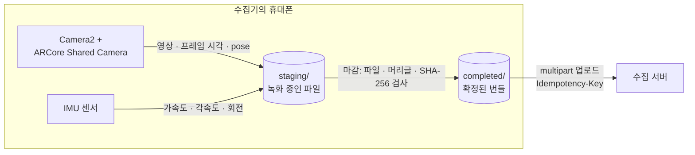

<div align="center">

# TIGER MASK

***T**arget-**I**nteraction **G**rounded **E**pisode **R**ecorder*<br>
***M**anual **A**cquisition **S**etting **K**eeper*

<br>

**스마트폰 한 대로 로봇 학습 데이터를 수집하는 Android 앱**

<br>


</div>

<br>

<table align="center">
  <tr>
    <td align="center"></td>
    <td align="center"></td>
  </tr>
  <tr>
    <td align="center"><b>수집기로 데이터를 수집하는 모습</b></td>
    <td align="center"><b>수집기의 휴대폰이 녹화한 영상</b></td>
  </tr>
</table>

<p align="center">
  <a href="#프로젝트-소개">소개</a> ·
  <a href="#주요-기능">주요 기능</a> ·
  <a href="#기술-스택">기술 스택</a> ·
  <a href="#아키텍처">아키텍처</a> ·
  <a href="#기술적-도전과-해결">기술적 도전</a> ·
  <a href="#수집-데이터">수집 데이터</a> ·
  <a href="#시작하기">시작하기</a>
</p>

<br>

## 성과

<table>
  <tr>
    <td align="center" width="33%"><h3>68개</h3>이 앱으로 수집한 시연</td>
    <td align="center" width="33%"><h3>94개</h3>학습에 쓸 수 있는 Episode</td>
    <td align="center" width="33%"><h3>21,532개</h3>로봇 학습 데이터셋의 학습 샘플</td>
  </tr>
</table>

<p align="right"><sub>시연 수는 이 앱의 수집 결과, Episode와 학습 샘플 수는 팀 데이터 파이프라인의 가공 결과</sub></p>

<br>

## 프로젝트 소개

### 전체 프로젝트

이 저장소는 **스마트폰 기반 저비용 로봇 데이터 수집 플랫폼**의 Android 앱입니다. 플랫폼은 3D 프린터로 만든 수집기와
스마트폰으로 사람의 시연(Human Demonstration)을 모으고, 이를 로봇 학습 데이터로 가공해 Diffusion Policy를
학습시킨 뒤, ROS2 + MuJoCo 환경에서 실행까지 검증합니다.



- **프로젝트 기간**: 2026.08.24 ~ 2026.09.30 (Android 앱은 9월 1일부터)
- **맡은 일**: Android 앱 1인 개발. 팀원이 정한 수집 요구사항을 Spec Kit으로 명세 · 계획 · 작업
  ([`specs/`](specs/))으로 구체화하고, 앱 구조와 데이터 구조를 설계해 구현하고 테스트했습니다.

### 왜 만들었나

스마트폰으로 로봇 학습 데이터를 모으려 하면 세 가지가 걸립니다.

- **설정이 매 순간 바뀝니다.** 자동 노출과 화이트 밸런스가 프레임마다 움직여, 같은 장면도 프레임마다 밝기와 색이
  다르게 찍힙니다.
- **가까운 곳이 흐립니다.** ARCore는 초점을 1 m 거리에 고정해 두어, 집게 끝처럼 가까운 작업 영역이 흐리게
  찍힙니다.
- **쓸 수 있는 구간을 가릴 수 없습니다.** 영상만으로는 어디가 실제 작업이었는지, 그때 ARCore가 휴대폰의 위치를
  제대로 잡고 있었는지 알 수 없습니다.

### 무엇을 하나

휴대폰은 **수집기**에 고정해 씁니다. 수집기는 사람이 손에 쥐는 집게 장치이고, 휴대폰은 위쪽 거치대에서 집게 끝을
내려다봅니다.

녹화를 시작하면 **Session**이 열리고, 끝낼 때까지 세 가지를 같은 시계에 맞춰 끊김 없이 수집합니다.

| 카메라 영상 | 움직임 센서(IMU) | 휴대폰의 위치와 방향 |
| :---: | :---: | :---: |
| 메인 카메라 영상과 프레임마다의 촬영 시각 | 가속도계 · 자이로스코프 · 회전 벡터 | ARCore가 추정한 카메라 pose |

Session 안에서 실제로 작업한 구간은 수집자가 직접 표시하고, 이 구간을 **Episode**라고 합니다. 녹화는 이어 둔 채
작업하는 동안만 Episode로 표시하므로, 자세를 고쳐 잡는 등의 준비 동작이 작업 구간에 섞이지 않습니다.

Session을 마치면 앱이 결과 파일을 검사해 **번들** 하나로 묶고 서버로 보냅니다. 서버는 그중 유효한 Episode를 학습
데이터로 씁니다.

> **이름의 뜻**
>
> - **TIGER** (**T**arget-**I**nteraction **G**rounded **E**pisode **R**ecorder): 대상 물체를 다루는 장면을 Episode
>   단위로 기록하는 수집 앱
> - **MASK** (**M**anual **A**cquisition **S**etting **K**eeper): 그 위에 얹은 기능으로, 사람이 정한 촬영 설정을
>   녹화 내내 지킴

<br>

## 주요 기능

### 작업 구간만 골라 표시하는 녹화

<p align="center">
  
</p>

재생 버튼으로 Session을 시작하고, ARCore가 휴대폰의 위치를 잡아 `READY`가 되면 재생과 일시 정지로 Episode를
시작하고 끝냅니다. 한 Session 안에서 Episode를 몇 번이고 반복할 수 있습니다. **Episode 도중 위치를 0.5초 넘게
놓치면 그 Episode만 무효로 마감**하고, Session은 그대로 이어집니다.

### 촬영 설정을 녹화 내내 고정하는 MASK

<p align="center">
  
</p>

녹화 해상도, 초점, ISO, 셔터, 화이트 밸런스를 수집자가 직접 고릅니다. 값은 **바꾸는 즉시 프리뷰에 반영**되어 화면을
보며 초점을 맞출 수 있고, Session이 시작되면 잠겨 끝날 때까지 바뀌지 않습니다. 자동 설정으로 10초를 찍으면 설정이
**74번** 바뀌지만, MASK로 고정하면 **0번**입니다. 고른 값은 다음 실행에도 기억하므로, 카메라
보정(checkerboard calibration)과 색 기준 촬영, 실제 데이터 수집을 날을 달리해도 같은 광학 조건에서 할 수 있습니다.

### 검사를 통과한 번들만 서버로

<p align="center">
  
  
  
</p>

- **결과 검사**: 파일이 빠짐없이 있는지, CSV 머리글이 맞는지, SHA-256 해시가 일치하는지 확인한 뒤에만 번들을
  확정합니다.
- **자동 업로드**: 마감 직후 서버로 올리고, 실패하면 상세 화면에서 다시 보냅니다. 같은 Session을 다시 보내도 서버가
  중복을 가려내도록 Session ID를 `Idempotency-Key`로 붙입니다.
- **중단 복구**: 녹화 도중 앱이 꺼져도, 다음 실행 때 남은 녹화를 검사해 정상 Session으로 마감합니다.
- **다시 보기와 정리**: Session을 Task별로 모아 보고, 영상을 재생하고, 필요 없는 Session을 기기에서 지웁니다.

<sub>위 화면은 에뮬레이터에서 예시 데이터로 찍었습니다.</sub>

<br>

## 기술 스택

| 분류 | 기술 |
| :--- | :--- |
| 언어 · UI |     |
| 카메라 · AR |    |
| 데이터 · 네트워크 |     |
| 미디어 |  |
| 개발 방식 |  |
| 빌드 · 품질 |    |

<br>

## 아키텍처

### 수집 파이프라인



카메라 하나를 ARCore와 녹화가 함께 씁니다(ARCore Shared Camera). 같은 카메라 프레임에서 ARCore는 위치를
추정하고 MediaRecorder는 영상을 저장하므로, 영상과 pose가 같은 시간축에 놓입니다. 카메라 시각이 기기 단조 시계와
같은 기준(`REALTIME`)이 아닌 기기에서는 Session을 시작하지 않습니다.

### 화면 상태 관리

- **수집 화면은 MVI**입니다. 처음에는 상태를 불리언 네 개로 표현해 16가지 조합이 생겼는데, 실제로 있을 수 있는
  상태는 다섯 가지뿐이었고 나머지는 호출 순서로만 막혀 있었습니다. 다섯 상태를 가진 열거형 하나로 바꿔 있을 수 없는
  상태를 타입이 막게 했습니다. 위치 추적 폴링 · 권한 콜백 · 생명주기 · ARCore 실패처럼 흩어져 경합하던 변경은
  `CaptureIntent`라는 하나의 입구로 모았고, 전이는 순수 함수 `reduce`라 Android 없이 단위 테스트합니다.
- **조회 화면은 상태 보유자만** 둡니다. Room이 내보내는 목록을 화면이 받아 그리고, 전송과 삭제만 얇은 보유자가
  맡습니다. 상태 기계가 없는 곳에 intent와 reducer를 두지 않습니다.
- **`ViewModel`과 DI 라이브러리를 쓰지 않습니다.** 수집 화면은 앱이 백그라운드로 가면 진행 중인 Session을 일부러
  마감하므로, 구성 변경 너머로 상태를 살리는 것이 오히려 해가 됩니다. 대신 다크 모드 전환만으로 데이터베이스와
  HTTP 클라이언트가 하나씩 더 생기던 문제를 고치면서, 앱 수명을 갖는 객체 셋을 `Application`의 필드로 옮겼습니다.

<br>

## 기술적 도전과 해결

### 무효 작업 구간의 마감 시각이 217 ms 어긋나던 문제

- **문제**  서버 쪽이 실제 업로드 데이터를 검토해, ARCore가 위치를 오래 놓친 구간도 정상 완료로 저장된다고 알려
  왔습니다. 그래서 Episode 도중 위치를 0.5초 넘게 놓치면 "첫 유실 시각 + 0.5초"에 무효로 마감하게 했는데,
  기록된 마감 시각이 그보다 217 ms 늦었습니다.
- **원인**  유실 시작을 "앱이 알아챈 시각"으로 잡아, ARCore의 pose 처리 지연과 100 ms 판정 주기가 그대로
  더해졌습니다. 이를 고친 뒤에도 67 ms가 남았는데, pose 스레드가 매 프레임 최신 시각을 덮어써 판정 주기 사이에
  두 프레임이 더 진행된 값이 읽혔기 때문입니다.
- **해결**  시계를 둘로 나눴습니다. 0.5초 판정은 기기의 단조 시계로 하고, 기록에는 카메라 pose 시각을 씁니다.
  첫 유실 pose 시각은 회복할 때까지 고정해 둡니다. 시계를 pose 시각 하나로 합치면 pose 지연 탓에 0.5초 미만의
  유실도 무효가 되므로, 이 함정은 단위 테스트로 막았습니다.
- **결과**  오차가 **217 ms → 67 ms → 0.0 ms**로 줄어, 기록된 마감 시각이 첫 유실 pose + 0.5초와 정확히
  일치합니다.

<br>

## 한계와 다음 단계

- **기기 한 대 기준**: Galaxy S10 하나에 맞춰 만들었습니다. 다른 기기는 카메라 스트림 조합과 수동 제어 범위가 달라
  따로 확인해야 합니다.
- **피사계 심도**: 초점은 한 거리에만 맞습니다. 작업 대상과 집게 끝이 한 초점면에 다 들어오지 않으면 조리개를
  조여 심도를 넓힐 수 있는데(S10은 F1.5 / F2.4), 지금은 조리개를 기기 기본값에 맡깁니다.
- **어두운 환경**: 수동 노출은 밝기를 잠그므로, 어두운 곳에서는 ARCore가 위치를 잡지 못할 수 있습니다. 이때는 ISO를
  올리거나 셔터를 1/30까지 늦춥니다. 1/30까지는 30 fps를 유지합니다.
- **초광각 카메라**: 메인 카메라만 기록합니다. 초광각을 함께 기록하는 것은 범위에서 뺐습니다.

<br>

## 수집 데이터

Session 하나가 아래 8개 파일로 이루어진 번들 하나가 됩니다.

| 파일 | 내용 |
| --- | --- |
| `main_rgb.mp4` | 메인 카메라 영상 |
| `main_frame_timestamps.csv` | 영상 프레임 번호와 그 프레임의 촬영 시각 |
| `accelerometer.csv` | 가속도계 값 |
| `gyroscope.csv` | 자이로스코프 값 |
| `rotation_vector.csv` | 회전 벡터 값 |
| `arcore_poses.csv` | ARCore가 추정한 카메라 위치 · 방향과, 위치를 잡고 있었는지(Tracking 상태) |
| `episodes.csv` | Episode마다의 시작 · 종료 시각과 결과(정상 완료, 또는 위치를 놓쳐 무효) |
| `metadata.json` | Session ID, 카메라 정보(해상도 · 내부 파라미터), 촬영 설정(요청값과 실제 적용값), 파일 목록과 SHA-256 |

번들은 앱 전용 내부 저장소에 두고, 확정한 뒤로는 수정하지 않습니다. 형식은
[Session `metadata.json` 계약](specs/003-session-episode-tracking-gate/contracts/session-metadata.md)과
[Capture Session Upload 계약](specs/001-episode-recorder/contracts/episode-upload.md)에 있습니다.

<br>

## 시작하기

<details>
<summary><b>요구 환경</b></summary>

<br>

- **실행**: ARCore를 지원하는 Android 9(API 28) 이상 기기와 최신 Google Play Services for AR. 개발에는
  Galaxy S10(SM-G973N)을 썼습니다.
- **빌드**: JDK 17 이상, Android SDK Platform 37. 저장소에 Gradle Wrapper가 들어 있어 Gradle을 따로 설치하지
  않아도 됩니다.

</details>

<details>
<summary><b>업로드 서버 주소 설정</b></summary>

<br>

저장소 루트의 `local.properties`에 서버 주소를 적습니다. 이 파일은 git에 올라가지 않습니다.

```properties
tigerUploadBaseUrl=http://<서버 주소>
```

빌드할 때 `-PtigerUploadBaseUrl=<서버 주소>`로 넘겨도 됩니다. 주소 없이 빌드해도 녹화는 되지만 업로드는 할 수
없습니다.

</details>

<details>
<summary><b>빌드와 설치</b></summary>

<br>

```powershell
.\gradlew.bat assembleDebug
adb install -r app\build\outputs\apk\debug\app-debug.apk
```

macOS · Linux에서는 `./gradlew assembleDebug`를 씁니다. 설치되는 앱의 패키지 이름은
`com.ssafy.s15p21a206.tigermask`입니다.

</details>

<details>
<summary><b>프로젝트 구조</b></summary>

<br>

```text
app/src/main/java/com/ssafy/s15p21a206/tiger/
├── TigerApplication.kt       앱 수명 객체(데이터베이스 · 저장소 · 업로드 서비스)
├── TigerApp.kt               앱 루트
├── TigerAppState.kt          수집 상태, 전송 · 삭제, 화면 이동이 얽힌 동작
├── navigation/               화면 경로와 NavHost
├── core/
│   ├── capture/              한 번의 수집을 여닫는 순서, Tracking 판정과 Episode 경계
│   │   ├── camera/           Camera2 녹화 · 프리뷰 세션, 녹화 해상도
│   │   ├── manual/           MASK 수동 촬영 설정
│   │   ├── arcore/           ARCore 프레임 처리, pose 기록, 프리뷰 그리기
│   │   └── writer/           IMU · Episode · 프레임 시각 CSV 기록
│   ├── session/              번들 마감 · 검사 · 복구
│   ├── upload/               서버 전송
│   ├── database/             Room. Session과 Episode 색인
│   ├── model/                capture · session · upload 데이터 모델
│   ├── designsystem/         테마와 공용 컴포넌트
│   ├── android/              Activity 접근, 화면 방향 고정
│   └── common/               공용 도우미
└── feature/
    ├── capture/              수집 화면
    │   ├── state/            상태 · Intent · 전이 (MVI)
    │   ├── driver/           권한 · 폴링 · 생명주기 같은 부수 효과
    │   ├── preview/          카메라 프리뷰
    │   ├── settings/         카메라 설정 시트
    │   ├── overlay/          프리뷰 위 상태 배지와 제어 버튼
    │   └── dialog/           수집 정보 입력, 종료 확인
    └── session/              조회 화면
        ├── list/             홈, Task 화면
        ├── detail/           Session 상세
        └── video/            영상 재생

app/licenses/                 앱에 넣은 글꼴의 라이선스
docs/images/                  README 이미지
specs/                        기능별 명세 · 계획 · 계약 문서
```

</details>

<br>

## 관련 문서

- **기능 명세와 설계**(Spec Kit 산출물): [`specs/001-episode-recorder/`](specs/001-episode-recorder/),
  [`specs/002-capture-control-ux/`](specs/002-capture-control-ux/),
  [`specs/003-session-episode-tracking-gate/`](specs/003-session-episode-tracking-gate/)
- **개발 규칙**: [`AGENTS.md`](AGENTS.md)에 빌드 · 테스트 · 커밋 규칙이, [`app/AGENTS.md`](app/AGENTS.md)에 코드 · 화면
  작성 규칙과 설계 결정의 이유가 있습니다.

<br>

## 오픈소스 라이선스

앱에 들어가는 라이브러리와 글꼴입니다.

| 이름 | 라이선스 |
| --- | --- |
| [AndroidX](https://developer.android.com/jetpack/androidx) (Activity, Compose, Core, Lifecycle, Navigation, Room, Media3) | Apache License 2.0 |
| [Material Components for Android](https://github.com/material-components/material-components-android) | Apache License 2.0 |
| [Kotlin](https://github.com/JetBrains/kotlin), [kotlinx.coroutines](https://github.com/Kotlin/kotlinx.coroutines), [kotlinx.serialization](https://github.com/Kotlin/kotlinx.serialization) | Apache License 2.0 |
| [OkHttp](https://github.com/square/okhttp) | Apache License 2.0 |
| [Pretendard](https://github.com/orioncactus/pretendard) | [SIL Open Font License 1.1](app/licenses/Pretendard-OFL.txt) |

[ARCore SDK for Android](https://github.com/google-ar/arcore-android-sdk)는 오픈소스가 아니며
[ARCore 추가 서비스 약관](https://developers.google.com/ar/develop/terms)을 따릅니다.

<details>
<summary>빌드와 테스트에만 쓰는 도구</summary>

<br>

| 이름 | 라이선스 |
| --- | --- |
| [Gradle](https://github.com/gradle/gradle), [Android Gradle Plugin](https://developer.android.com/build), [KSP](https://github.com/google/ksp) | Apache License 2.0 |
| [AndroidX Test](https://github.com/android/android-test) (Espresso 포함), [MockWebServer](https://github.com/square/okhttp/tree/master/mockwebserver) | Apache License 2.0 |
| [JUnit 4](https://github.com/junit-team/junit4) | Eclipse Public License 1.0 |
| [ktlint](https://github.com/pinterest/ktlint), [ktlint Gradle plugin](https://github.com/JLLeitschuh/ktlint-gradle) | MIT License |

</details>
